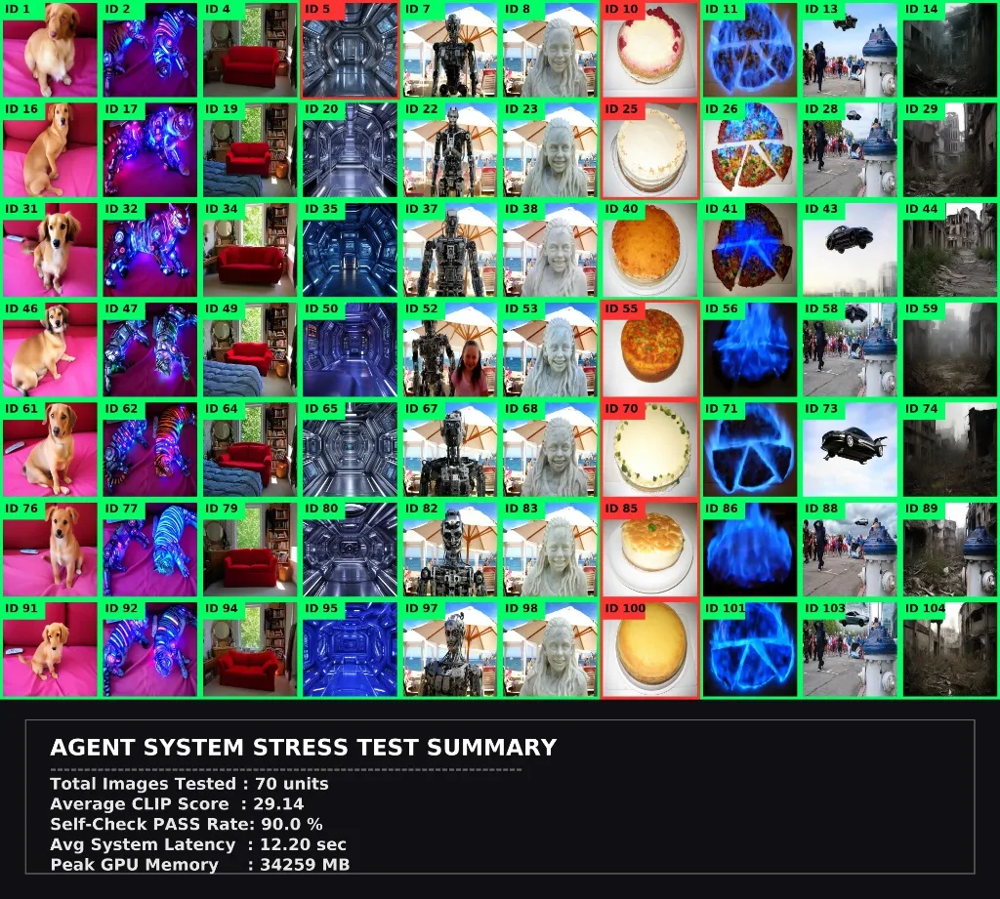
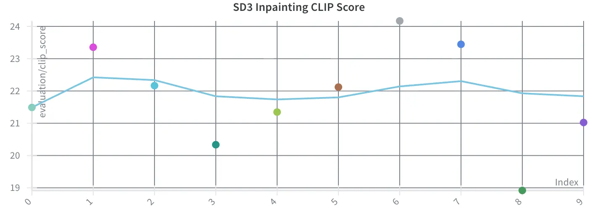
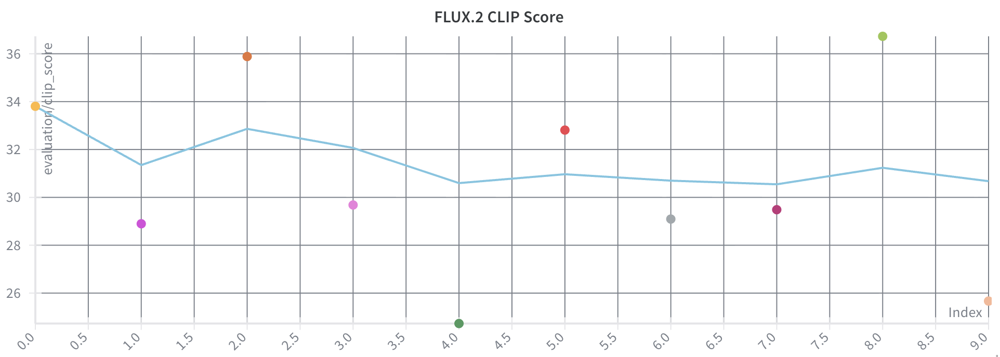
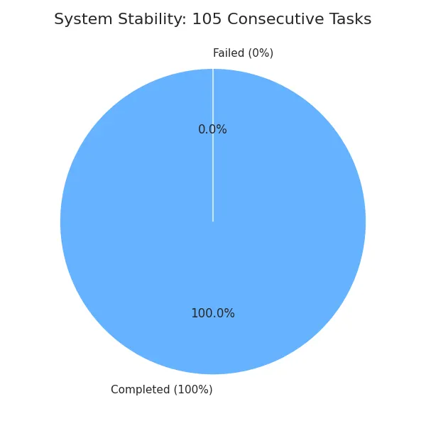

# **Interactive Multimodal AI Agent API Server**
**High-Performance AI Serving with Intelligent Task Scheduling & Self-Healing Architecture**

VRAM 48GB 환경에서 고사양 생성 모델(FLUX.2)의 서빙 최적화를 달성하고, 시스템 안정성(Fault Tolerance)과 품질 보증(Self-Feedback)을 자동화한 자율형 에이전트 시스템입니다.

* **Throughput**: 지능형 큐 분리로 응답 속도 85% 개선.
* **Stability**: 100+ 연속 고부하 태스크 완주 (성공률 100% 자가 복구).
* **Quality**: CLIP Score 평균 29.12 달성.

 

## 🏗️ Core Engineering Competencies

### 1. 가치 중심의 아키텍처 재설계 (Development)
* **Modular Pipeline vs. End-to-End**
  * 기존 `SD3 + SAM + Detection` 조합의 모델 로딩 오버헤드와 마스크 결합의 부자연스러움 문제를 데이터로 진단하였습니다.
* **의사결정**
  * 단일 **FLUX.2 Img2Img** 아키텍처로 일원화하여 시스템 복잡도를 낮췄으며 **CLIP Score를 평균 22.1에서 29.12로 약 32% 개선**하는 성과를 거두었습니다.
* **Context Preservation**
  * 하드웨어 제약으로 `strength` 인자 조절이 어려운 환경을 극복하기 위해, 원본 이미지의 문맥을 프롬프트 수준에서 보존하는 **Context-Aware Prompt Engineering** 기법을 적용했습니다.

| SD3 Inpainting (Previous) | FLUX.2 Img2Img (Current) |
| :---: | :---: |
|  |  |
*SD3의 영역 제한적 편집 대비, FLUX.2의 높은 컨텍스트 유지력 및 시각적 품질 확인*

### 2. 고부하 모델 서빙 및 장애 탄력성 (Deployment)
* **Hybrid Concurrency Model**
  * GPU 연산 중심의 Heavy Task는 **Multi-Processing(Solo Pool)** 으로 격리하여 병렬성을 확보하고, API 및 VQA 분석은 **Asynchronous Pool(Gevent)** 을 활용하여 Throughput을 극대화했습니다.
* **Self-Healing Architecture**
    * **Fault Tolerance**: OOM(Memory Out-of-memory) 발생 시 시스템 다운을 방지하는 **Exponential Backoff 재시도 전략**을 도입했습니다.
    * **Resource Governance**: 각 태스크 종료 후 `torch.cuda.empty_cache()` 및 `gc.collect()`를 호출하는 선제적 메모리 세정 로직을 통해 **105회 연속 스트레스 테스트 성공률 100%** 를 달성했습니다.

### 3. 데이터 기반 성능 최적화 (Optimization)
* **Deep Profiling**: `torch.profiler` 분석 결과, 연산의 **80%가 Matrix Multiplication(`cutlass::Kernel`)** 에 집중됨을 파악하여 최적화 타겟을 명확히 정의했습니다.
* **Inference Acceleration**:
    * `torch.compile` (mode="reduce-overhead")을 적용하여 GPU 추론 시간을 **약 57% 단축**했습니다(114.7s → 49.8s).
    * **Step Optimization**: 품질 저하 없는 최소 Step(20 → 8)을 도출하여 최종 Latency를 17초대까지 최적화했습니다.
* **Cold Start 개선**: **Model Warm-up & Caching** 전략을 통해 초기 로딩 오버헤드를 제거하여 전체 응답 속도를 113초에서 33초로 개선했습니다.

 

## 🏆 Key Performance Metrics (Benchmarks)

| Metric | Before Optimization | After Optimization | Improvement |
| :--- | :---: | :---: | :---: |
| **Avg. Latency (Heavy)** | 113.4s | **17.2s** | **85% ↓** |
| **Response Time (Light)** | 17.0s | **2.0s** | **88% ↓** |
| **CLIP Score (Quality)** | 22.1 | **29.12** | **32% ↑** |
| **Stress Test Success** | 0% (OOM) | **100% (105/105)** | **Reliability 확보** |

### System Stability & Performance Summary

*105회 연속 스트레스 테스트 결과: 성공률 100%, 평균 CLIP Score 29.14 달성*

## 🛠️ Troubleshooting: Engineering Deep Dive

### [Case 01] CUDA Context Collision & OOM Recovery
* **현상**: `prefork` 방식의 워커가 부모의 CUDA 컨텍스트를 복제하려다 `Cannot re-initialize CUDA` 에러 발생 및 병렬 요청 시 VRAM 임계점 돌파.
* **분석**: Python `fork` 방식의 한계와 FLUX.2(34GB) 모델 두 개가 48GB 자원을 동시 점유하려는 리소스 경합 확인.
* **해결**:
    1. **Solo Pool 격리**: 각 워커를 독립된 프로세스로 실행하여 컨텍스트 충돌 원천 차단.
    2. **Intelligent Queuing**: Heavy/Light 전용 큐를 분리하여 가벼운 작업이 무거운 작업에 가로막히지 않는 **추월 처리(Preemption)** 구현.

### [Case 02] SAM 2.1 Tensor Dimension Mismatch
* **현상**: Transformers 라이브러리의 SAM2 미지원으로 인한 텐서 차원 불일치(256x256 vs 600x444).
* **해결**: 라이브러리 업데이트에 의존하지 않고 프레임워크 내부 구조를 분석, `upscaled_masks` 차원을 직접 수정하고 **Nearest Interpolation** 보간법을 적용해 퀄리티 저하 없이 에러를 해결했습니다.

 

## 🧪 Benchmark Test Scenarios

| Category | Input Image | Task: Easy (Object Mod) | Task: Hard (Stylization) | Task: VQA (Reasoning) |
| --- | --- | --- | --- | --- |
| **Animal** | 🐱 Cat | "change the cat to a dog" | "make the cat look like a cyborg tiger with neon lights" | "what is the animal doing?" |
| **Interior** | 🛋️ Room | "add a red sofa in the center" | "transform the room into a futuristic spaceship interior" | "what is the color of the wall?" |
| **Portrait** | 👤 Person | "change the person to a robot" | "make the person look like a marble statue" | "is the person smiling?" |
| **Food** | 🍕 Food | "change the pizza to a cake" | "make the food look like it is burning with blue fire" | "what kind of food is this?" |
| **Landscape** | 🏙️ City | "add a flying car in the sky" | "make it look like a post-apocalyptic ruin" | "is it day or night?" |

 

## 📊 상세 실험 보고서 (Detailed Reports)
단순한 코드 구현을 넘어, 엔지니어링 관점에서 마주한 병목 지점과 해결 과정을 데이터로 기록했습니다.
* [실험 보고서 01: 비동기 스케줄링 및 Throughput 최적화](./docs/EXPERIMENT_REPORT_01.md)
* [실험 보고서 02: FLUX.2 전환 및 가속화 분석](./docs/EXPERIMENT_REPORT_02.md)
* [Appendix: eventlet 도입 시도 및 Compute-Bound 작업 회고](./docs/APPENDIX_EVENTLET.md)

 

> **Engineering Mindset: Optimization & Reliability**
> 
> 모델을 돌리는 것에 그치지 않고 **시스템의 병목(Bottleneck)** 을 찾아내고 데이터로 증명했습니다. SD3에서 발생한 60초의 I/O 공백을 발견하여 **Model Caching**으로 해결하였고, FLUX.2의 느린 추론 속도를 **`torch.compile`** 과 **Warm-up 전략** 으로 최적화했습니다. 또한, **SAM 2.1의 텐서 차원 불일치** 문제를 수동 보간(Nearest interpolation)으로 해결하는 등 라이브러리 내부 구조를 파고드는 해결 능력을 갖추고 있습니다.