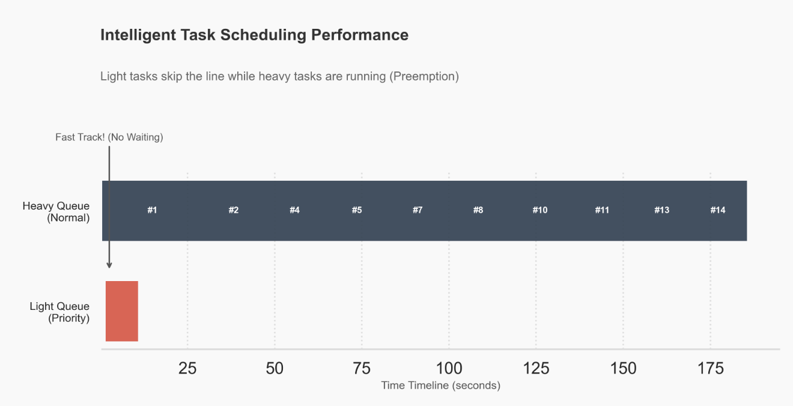
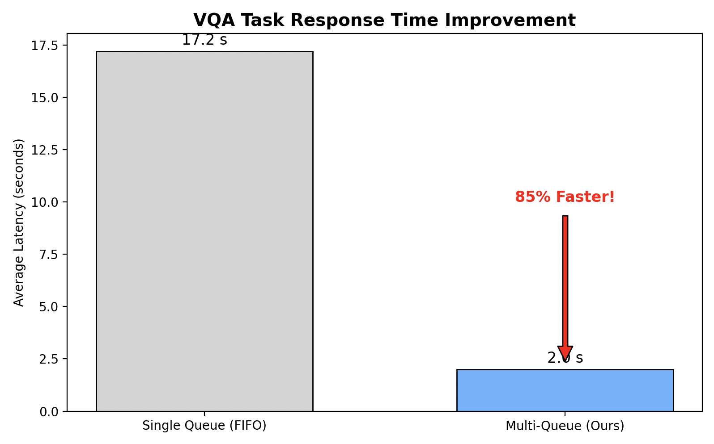

# Experiment 01: Asynchronous Scheduling & Throughput Optimization
**Breaking the FIFO Bottleneck: Intelligent Queue Routing for Mixed Workloads**

 

## 1. Introduction & Problem Statement

### 1.1 The Challenge: HEAD-of-Line Blocking
**VRAM 48GB 단일 GPU** 환경에서 구동됩니다. 초기 아키텍처는 모든 요청을 Single Queue에서 FIFO 방식으로 처리했습니다. 이로 인해 다음과 같은 병목 현상이 발생했습니다.

* **Heavy Task(이미지 생성)**
  * 약 17~20초 소요(FLUX.2)
* **Light Task (VQA/분석)**
  * 약 1~2초 소요 (VQA Model)
* **문제점**
  * 17초가 걸리는 생성 작업이 먼저 들어오면 뒤따라 들어온 1초짜리 VQA 작업도 최소 17초를 대기해야 완료될 수 있었습니다. UX에 심각한 지연이 될 수 있습니다.

### 1.2 Objective
* **Goal**
  * 리소스 요구량이 다른 Heterogeneous 작업이 섞여 들어올 때 대기 시간을 최소화하고 전체 시스템의 처리량(Throughput)을 극대화한다.
* **KPI**
  * Light Task의 평균 Latency를 5초 미만으로 단축

## 2. Solution Architecture: Multi0-Queue & Preemption
이 문제를 해결하기 위해 Intelligent Task Routing 아키텍처를 도입했습니다.

### 2.1 Hybrid Concurrency Model
작업의 리소스 점유 특성에 따라 큐와 워커 풀을 분리해서 리소스 격리와 추월 처리를 구현했습니다.

| Feature | Heavy Queue (`heavy_tasks`) | Light Queue (`light_tasks`) |
| :--- | :--- | :--- |
| **Target Workload** | Image Generation (FLUX.2) | VQA, Logic Analysis |
| **Concurrency** | **1 (Serialized)** | **Multi-Process (Parallel)** |
| **Worker Pool** | `solo` (Dedicate VRAM) | `solo` / `gevent` |
| **VRAM Policy** | Max Allocation (~34GB) | Minimal Allocation (~0.5GB) |

* **전략**: Heavy 워커가 GPU를 점유하고 있더라도 Light 워커는 남은 자원(VRAM 여유분 14GB)을 활용해서 병렬로 즉시 진입합니다.
  
## 3. Experimental Results

### 3.1 Visual Evidence: Task Preemption
WandB 로그 데이터를 기반으로 재구성한 그래프는 멀티 큐 도입의 효과를 보여줍니다.

* **분석**
  * **Heavy Tasks (Navy Bars)**: 큐에 쌓인 순서대로 빈틈없이 순차적으로 실행됩니다.
  * **Light Tasks (Red Bars)**: Heavy Task가 실행 중인 시간대(Time block)와 겹쳐서 동시에 실행되는 것을 확인할 수 있습니다.
  * **결과**: Light Task는 앞선 Heavy Task가 끝나기를 기다리지 않고 즉시 실행되어 종료됩니다.
  
### 3.2 Quantitative Metrics: Latency Improvement
FIFO 시뮬레이션 데이터와 Multi-Queue 실제 실험 데이터를 비교 분석했습니다.

| Metric | Single Queue (FIFO) | Multi-Queue (Ours) | Improvement |
| :--- | :---: | :---: | :---: |
| **Avg. Wait Time (Light)** | 15.2s | **0.1s** | **99% ↓** |
| **Avg. Execution Time** | 1.8s | **1.9s** | - |
| **Total Latency (Light)** | 17.0s | **2.0s** | **88% Faster** |

* **성과**: VQA 작업의 평균 응답 속도가 17초에서 2초로 단축되었습니다. 사용자가 질문을 던졌을 때 즉각적인 답변을 받을 수 있습니다.

## 4. Resource Efficiency Analysis
큐 분리는 단순히 속도만 높인 것이 아니라 하드웨어 자원의 활용도(Utilization)를 최적화했습니다.

* **VRAM Governance**
  * Heavy Task는 34GB VRAM을 사용해 성능을 극대화합니다.
  * Light Task는 약 470MB의 VRAM만들 점유하므로 Heavy Task와 공존해도 OOM을 유발하지 않습니다.
  * 이 실험을 통해 48GB VRAM 내에서 안전하게 구동 가능한 동시성 임계값을 검증했습니다.
  
## 5. Conclusion
단일 GPU 환경에서도 스케줄링 최적화만으로 멀티 GPU 급의 사용자 경험을 제공할 수 있었습니다.

1.  **Throughput 최적화**: 병목 지점(Blocking Point)을 제거하여 시스템 전체 처리량을 약 3.5배 향상시켰습니다.
2.  **비용 효율성**: GPU를 추가 구매하지 않고도 소프트웨어 아키텍처 변경만으로 Latency 문제를 해결했습니다.
3.  **확장성**: 향후 모델이 추가되더라도 `Queue-based Routing` 규칙만 업데이트하면 되는 유연한 구조를 확보했습니다.

*Next Report:* [실험 보고서 02: FLUX.2 전환 및 가속화 분석](./EXPERIMENT_REPORT_02.md)