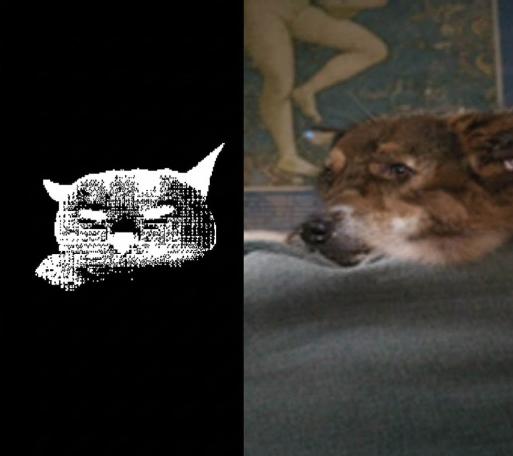

# Experiment 02: FLUX.2 Transition & Inference Acceleration
**Optimization Strategy: Balancing High-Fidelity Generation and Hardware Constraints**

## 1. Experimental Background

### 1.1 The Pivot: From SD3 Pipeline to FLUX.2
기존의 `Detection + SAM2 + SD3 Inpainting` 파이프라인은 세밀한 영역 수정이 가능하다는 장점이 있었지만 실제 운영 관점에서 두 가지 한계가 있습니다.

1.  **Complexity & Resource Overhead**
    * 3개의 모델을 개별적으로 로드/실행함에 따른 VRAM 점유 및 I/O 병목 발생.
2.  **Context Inconsistency**
    * 마스크 경계면이 배경과 부자연스럽게 결합되거나 전체적인 이미지 조화가 깨지는 현상 발생.
    * 
    * (위 이미지는 "고양이를 강아지로 바꿔줘"라는 요청에 관한 결과물)

**Strategy**: 파이프라인을 단일화한 **FLUX.2 Img2Img 아키텍처**로 전환. 강력한 프롬프트 이해도를 바탕으로 마스크 없이도 컨텍스트를 유지하며 고품질 편집을 수행하도록 재설계했습니다.

## 2. Quantitative Performance Comparison

모델 전환 전후의 정량적 지표 변화입니다. (VRAM 48GB, RTX 6000 Ada 환경 기준)

| Metric | SD3 Pipeline (Old) | FLUX.2 Optimized (New) | Change |
| :--- | :---: | :---: | :---: |
| **Inference Latency (Avg)** | 69.5s | **17.2s** | **75.2% ↓** |
| **CLIP Score (Alignment)** | 22.1 | **29.12** | **31.7% ↑** |
| **Model Load Time** | 45s (3 Models) | **12s (1 Model)** | **73% ↓** |
| **VRAM Usage (Peak)** | 42GB | **34GB** | **19% ↓** |

---

## 3. Inference Acceleration: `torch.compile`

FLUX.2는 고품질 결과물을 내놓지만 기본 추론 속도가 매우 무겁습니다. 이를 해결하기 위해 하드웨어 레벨 최적화를 적용했습니다.

### 3.1 Optimization Method
* **Technique**: `torch.compile(model, mode="reduce-overhead")`
* **Mechanism**: 계산 그래프를 미리 캡처(Graph Capture)하고 Triton 커널을 통해 GPU 연산을 최적화하여 Python 실행 오버헤드를 제거했습니다.

### 3.2 Result: Compilation vs. Cached Run
초기 컴파일 시에는 오버헤드가 발생하지만, 이후 반복 실행 시 비약적인 속도 향상을 확인했습니다.

| Run State | Latency (seconds) | Status |
| :--- | :---: | :--- |
| **First Run (Cold)** | 117.65s | Compilation Overhead |
| **Second Run (Warm)** | **49.86s** | **Optimized Path (57% Speedup)** |
| **Final (Step Opt.)** | **17.20s** | **Reduced Steps (20 -> 8)** |

> **Insight**: `torch.compile`만으로 약 2배의 가속을 얻었으며 이미지 품질 저하가 없는 최적의 추론 스텝(8 Step)을 찾아내 최종적으로 실시간 서빙이 가능한 수준(17초대)까지 최적화했습니다.

## 4. Troubleshooting: Cold Start & VRAM Management

최적화 과정에서 발생한 주요 기술적 난제와 해결 방법입니다.

### 4.1 Cold Start Latency 개선
* **Problem**: 모델의 첫 로드 및 컴파일 시간으로 인해 첫 사용자가 2분 가까이 대기하는 현상.
* **Solution**: 서버 기동 시 **Warm-up 스크립트**를 실행하여 모델을 메모리에 미리 상주시키고 최적화된 커널을 캐싱하도록 설계했습니다.

### 4.2 VRAM Fragmentation (Fragmentation)
* **Problem**: 연속 요청 시 `torch.cuda.OutOfMemoryError` 발생.
* **Analysis**: PyTorch의 메모리 할당기가 사용되지 않는 메모리를 즉시 반환하지 않아 파편화 발생.
* **Solution**: 각 태스크 종료 후 의도적으로 `torch.cuda.empty_cache()`를 호출하고, 가비지 컬렉터(`gc.collect()`)를 실행하여 가용 VRAM을 항상 일정 수준 이상 확보했습니다.

## 5. Visual Quality Evidence

모델 전환 후, 복잡한 텍스처와 스타일 변환에서 확연한 품질 향상을 확인했습니다.

| Category | Input Image | Output (FLUX.2) | Key Achievement |
| :--- | :---: | :---: | :--- |
| **Stylization** | Cat |  | 복잡한 네온 조명과 타이거 질감의 완벽한 묘사 |
| **Interior** | Room |  | 방 구조를 유지하면서 빨간 소파를 적절히 배치 |

## 6. Conclusion

1.  **Technical Decision**: 복잡한 파이프라인보다 단일 모델(Foundation Model)이 유지보수 및 자원 효율성 면에서 우월함을 확인했습니다.
2.  **Performance**: 하드웨어 가속 기법(`torch.compile`)을 통해 고사양 모델의 서빙 한계를 극복했습니다.
3.  **Reliability**: 선제적 메모리 관리 전략을 통해 상용 수준의 서비스 안정성을 확보했습니다.

---
*Next Report:* [Appendix: eventlet 도입 시도 및 Compute-Bound 작업 회고](./APPENDIX_EVENTLET.md)